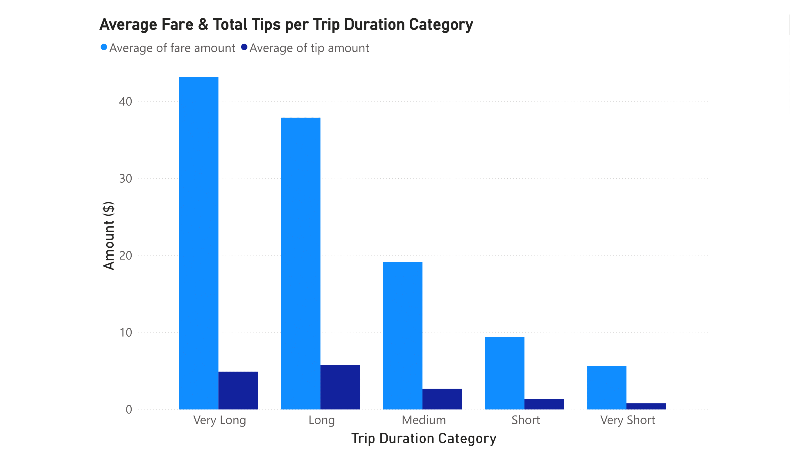
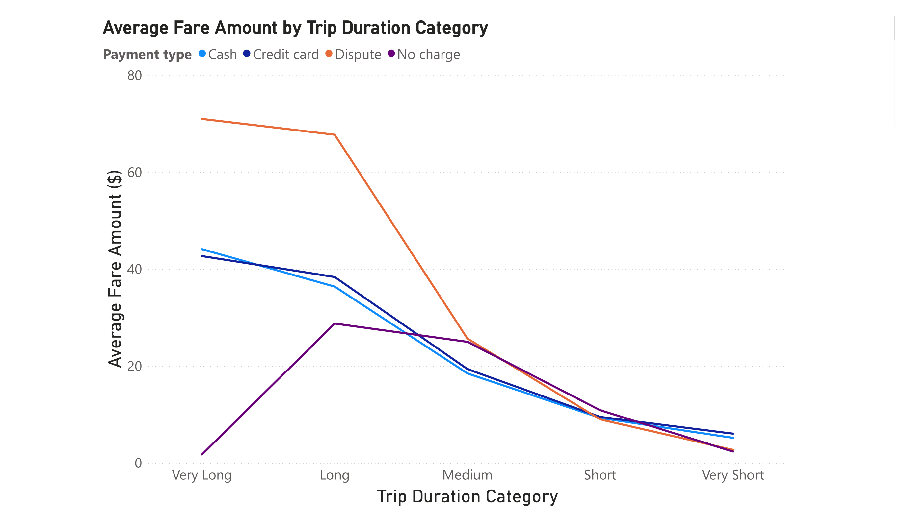
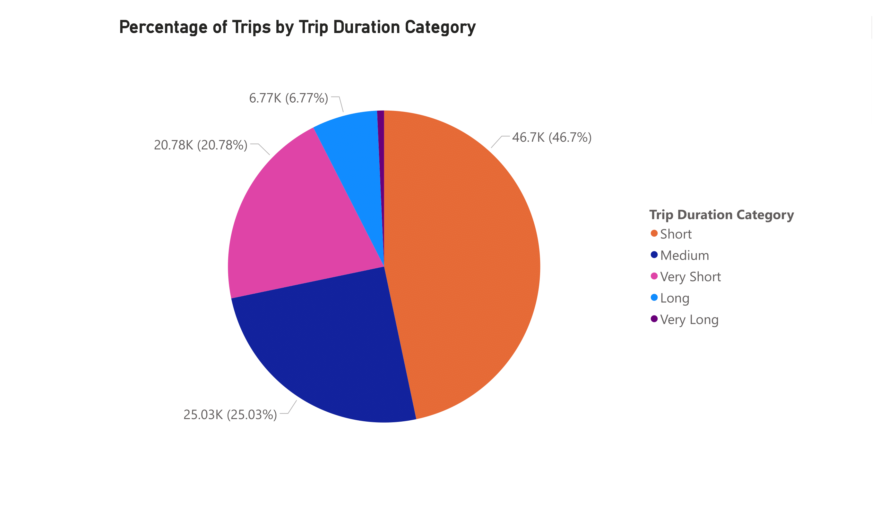
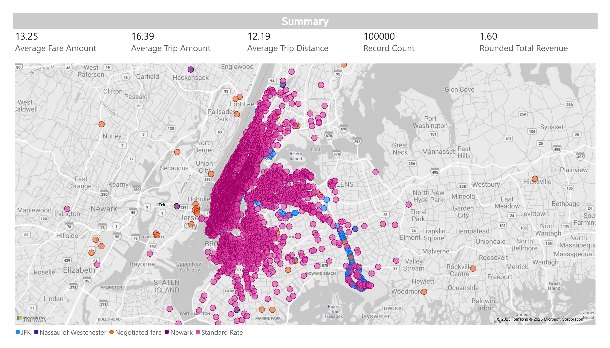
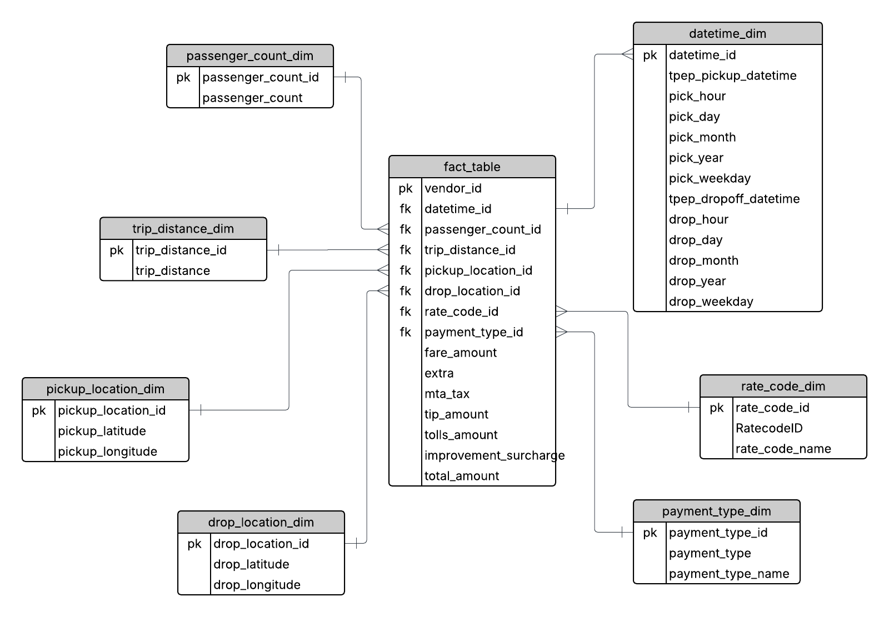

# **Uber Data Analysis and Database Design Project**

## **Project Overview**
This project focuses on analyzing and processing a dataset of Uber trip data, aiming to construct a data warehouse schema composed of dimension and fact tables. The project is structured around the **Kimball methodology** for building a star schema. The dataset includes various attributes such as trip ID, passenger count, trip distance, fare amount, payment type, pickup and dropoff locations, and more. The main goal was to design an ETL process that converts raw data into a format suitable for analysis and reporting.

## **Process Overview**
The process consists of the following major steps:
1. **Data Cleaning and Preprocessing**: Importing and preparing the data for transformation and analysis.
2. **Dimensional Modeling**: Creating dimension tables that capture business-relevant entities, such as time (datetime), passenger count, trip distance, payment type, and locations.
3. **Fact Table Creation**: Combining the dimension tables with the raw trip data to create a fact table, which holds the core transactional data (trip details) and links to the dimension tables via foreign keys.
4. **Data Loading into MySQL**: Loading the processed data into a MySQL database, creating a well-structured schema for easy querying and reporting.

## **Step-by-Step Description**

### 1. **Loading and Preprocessing the Data**
The first step involved loading the raw Uber trip data from a CSV file. The data was inspected, cleaned, and transformed for further processing:
- **Datetime Processing**: The `pickup_datetime` and `dropoff_datetime` columns were converted into `datetime` format, allowing for easier manipulation and feature extraction.
- **Removing Duplicates**: Duplicates were removed to ensure data integrity.

### 2. **Dimension Tables Creation**
The following dimension tables were created from the dataset:

- **Datetime Dimension**: This table captures time-related attributes like the hour, day, month, and year of both pickup and dropoff times.
- **Passenger Count Dimension**: This table holds unique values for the passenger count, providing a reference for the number of passengers in each trip.
- **Trip Distance Dimension**: This table stores unique trip distance values, helping to normalize trip distances across the dataset.
- **Rate Code Dimension**: This table associates each trip's `RatecodeID` with a descriptive label (e.g., Standard Rate, JFK, Newark).
- **Location Dimensions (Pickup and Dropoff)**: These tables store unique combinations of pickup and dropoff locations using latitude and longitude coordinates.
- **Payment Type Dimension**: This table links each trip to a payment method (e.g., credit card, cash).

### 3. **Fact Table Construction**
Once the dimension tables were created, they were merged with the original trip data to create a **fact table**. This table includes:
- A unique `trip_id` for each record.
- Foreign keys to link to each of the dimension tables (e.g., `datetime_id`, `passenger_count_id`, `trip_distance_id`).
- Key metrics like `fare_amount`, `tip_amount`, and `total_amount`, which are the core facts of the dataset.

### 4. **Loading the Data into MySQL**
After constructing the fact and dimension tables, the final step was to load the data into a MySQL database. The process used the `pandas` library in Python to insert the data into MySQL tables via the `SQLAlchemy` engine:
- The fact table and dimension tables were created in the MySQL database.
- The tables were inserted into the database using the `to_sql()` function.
- The schema is now ready for analysis and querying.

### 5. **Data Exploration and Querying in MySQL**

After loading the structured data into the MySQL database, several SQL queries were executed in **MySQL Workbench** to explore the data and extract preliminary insights. These queries helped verify the integrity of the ETL process and supported deeper understanding of usage patterns and revenue distribution. In particular, a new table, **trip_duration_categories**, was created to categorize trips based on their duration. The table was constructed using the following SQL query:

### 6. **Visualization in Power BI**

After loading the data into MySQL, the structured schema was connected to **Power BI** for advanced data visualization and analysis. Using the MySQL database connector, the dimension and fact tables were imported into Power BI and relationships were defined accordingly, following the star schema structure.

## Dashboards and Charts Created:

1. **Average Fare & Total Tips per Trip Duration Category**
   - **Chart Type**: Clustered Column Chart
   - **Description**: This chart visualizes the average fare amount and the total tip amount for each trip duration category (e.g., Very Short, Short, Medium, Long, Very Long). It helps to understand the relationship between fare and tips across different trip durations.

2. **Average Fare Amount by Trip Duration Category**
   - **Chart Type**: Line Chart
   - **Description**: This chart displays the average fare amount for each trip duration category, showing how the fare amount changes as the trip duration increases. It provides insight into the correlation between trip duration and fare amounts.

3. **Percentage of Trips by Trip Duration Category**
   - **Chart Type**: Pie Chart
   - **Description**: This chart illustrates the distribution of trips across different trip duration categories in the form of percentages. It highlights how frequently each trip length occurs, providing a clear overview of user behavior and the dominance of short or long trips within the dataset.

5. **Interactive Map of Trip Pickup Locations**
   - **Chart Type**: Interactive Map
   - **Description**: An interactive map was created using **Folium** in Python, visualizing the spatial distribution of trip pickup points across New York City. This map provides geographical insights into the density and spread of trip activity, helping to identify high-demand areas and possible service patterns. The visualization enhances spatial understanding beyond tabular or chart-based analyses.

## **Technologies Used**
- **Python**: For data manipulation, preprocessing, and ETL (using libraries like `pandas` and `sqlalchemy`).
- **MySQL**: For storing and querying the processed data in a structured database.
- **SQLAlchemy**: For connecting and interacting with the MySQL database from Python.
- **pandas**: For data manipulation and table creation.
- **Power BI**: For creating interactive dashboards and visualizing insights using data imported from the MySQL database.

## **Database Schema Diagram**

## **Project Structure**
The project consists of the following files:
- `process_data.py`: Python script containing the entire ETL pipeline.
- `data/uber_data.csv`: The raw data file used for processing.
- `images/blank_diagram`: The Database Schema Diagram.
- `plots/`: All the charts, plots and maps.

